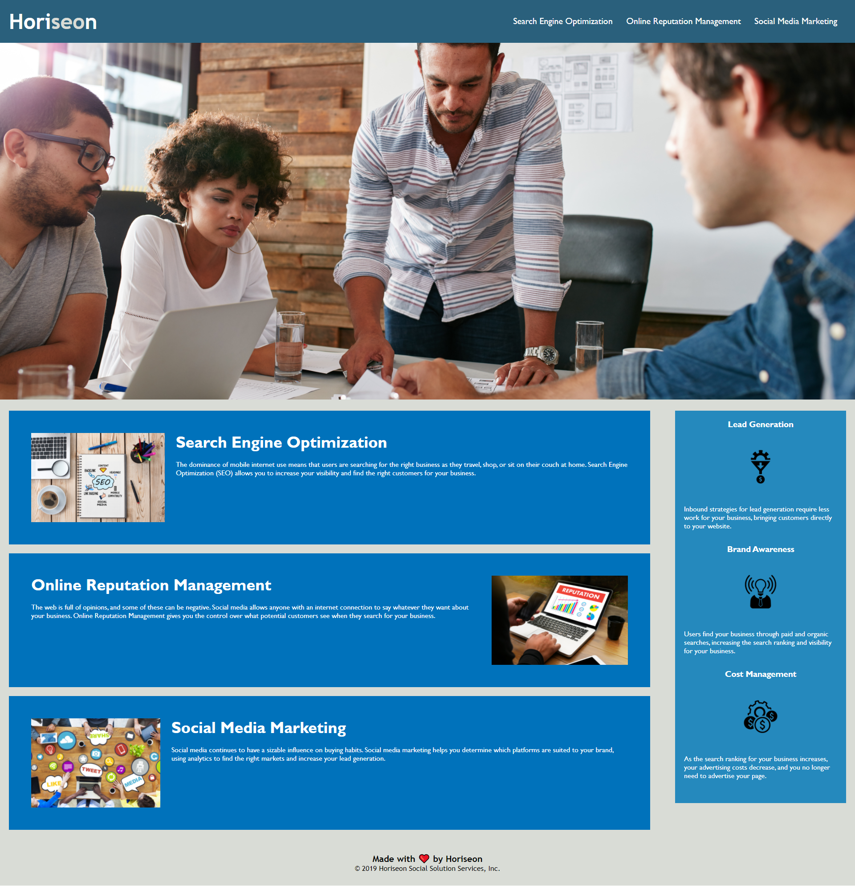

Link to Application: https://dylan-fair.github.io/Horiseaon-Media/
Description: Horiseon Media is a media company looking to improve the online impact of companies. Using targeted approaches such as Search Engine Optimization, Online Reputation Management, and Social Media Marketing to do so. Within the application the text at the header takes the user to each section. Each image is linked and has an alt for people who may be hearing the page. The page is coded and for all adaptive online users to allow for the best experience. The CSS styles are compact using same styles for different sections with classes. The html follows a flow of how the page is laid out and uses unique separators like section or nav to better understand each section!

Screen Shot:
